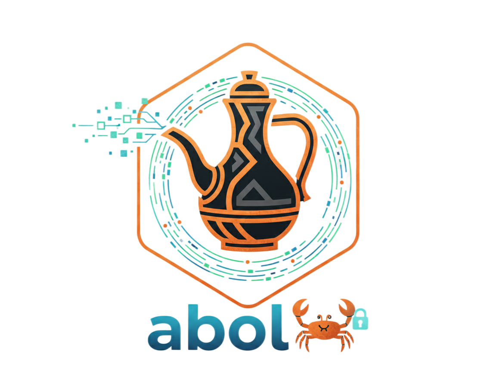

# Abol



**A high-performance, asynchronous RADIUS implementation for Rust**

**Type-safe • Runtime-agnostic • Dictionary-driven • Memory-safe**

------------------------------------------------------------------------

## 🚀 Quick Start

``` toml
[dependencies]
abol = "0.1.0"
abol-util = { version = "0.1.0", features = ["tokio"] }
tokio = { version = "1.0", features = ["full"] }
```

------------------------------------------------------------------------

## 📖 What is Abol?

**Abol** is a high-performance, asynchronous **RADIUS server framework**
written in Rust.

It provides a robust, type-safe foundation for building modern
authentication and authorization systems, featuring a powerful
**dictionary-driven code generator** that turns standard RADIUS
dictionaries into strongly-typed Rust APIs.

Abol is designed for correctness, extensibility, and performance ---
without sacrificing ergonomics.

------------------------------------------------------------------------

## ☕ What's in a Name?

In the traditional Ethiopian coffee ceremony, **Abol** is the **first
round of brewing**.

It is the strongest, most potent, and most important cup ---
representing clarity, connection, and readiness.

Like its namesake, **Abol** serves as the primary and reliable
connection point for your network authentication infrastructure.

------------------------------------------------------------------------

## ⚡ Why Abol?

### 🚀 Runtime-Agnostic Core

Optimized for high performance while remaining compatible with multiple
async runtimes, including **Tokio** and **Smol**.

### 🧠 Zero-Cost Abstractions

Leverages Rust's type system and traits to provide **type-safe attribute
access** with zero runtime overhead.

### 📚 Dictionary-Driven Design

Automatically generate Rust traits and helpers from standard RADIUS
dictionary files at **build time**.

### 🛡 Memory Safety by Default

Implemented **100% in safe Rust**, protecting your authentication
gateway from memory corruption and buffer overflows.

------------------------------------------------------------------------

## 🚀 Performance

Abol is engineered for high-concurrency environments. Below are the results of a benchmark conducted on a standard development machine using `radperf`.

> **Test Environment**
> - **OS:** Kali GNU/Linux 2025.3 (Kernel 6.17.10)
> - **CPU:** Intel® Core™ i7-8850H @ 2.60GHz (12 Cores)
> - **RAM:** 32 GiB DDR4
> - **Platform:** Wayland / KDE Plasma 6.3.6

**Benchmark Command:**
```bash
radperf -d . -f test_users.csv -a pap -s -c 100000 -p 150 127.0.0.1 auth testing123
```

<div align="center">

| Metric | Result |
| :--- | :--- |
| **Throughput** | <code>🚀 34,141 packets/s</code> |
| **Success Rate** | <code>✅ 100% (0 failures)</code> |
| **Latency** | <code>⏱️ < 10ms (93.5% of reqs)</code> |
| **Total Workload** | <code>📦 100,000 requests</code> |
| **Execution Time** | <code>⏳ 2.92 seconds</code> |

</div>

## 📚 Dictionaries & Vendor Support

### Supported RFCs

-   RFC 2865 --- Remote Authentication
-   RFC 2866 --- Accounting
-   RFC 2869 --- Extensions
-   RFC 3576 --- Dynamic Authorization
-   RFC 6911 --- IPv6 Attributes

### Vendor-Specific Attributes

-   Aruba
-   Microsoft
-   WISPr

------------------------------------------------------------------------

## 🧪 Example: Simple Authentication Server

``` rust
use abol::codegen::rfc2865::Rfc2865Ext;
use abol::core::{Cidr, Code, Request, Response};
use abol::rt::Runtime;
use abol::server::{HandlerFn, SecretManager, SecretSource, Server};
use abol_util::rt::tokio::TokioRuntime;

use std::net::SocketAddr;
use std::sync::Arc;

/// A simple "Global Password" provider for your RADIUS server.
///
/// Use this if you want every single client (NAS) to use the same shared secret,
/// regardless of their IP address. It is the easiest way to get started.
pub struct StaticSecretSource {
    /// The shared secret (password) used to authenticate RADIUS packets.
    pub secret: Vec<u8>,
}

impl SecretSource for StaticSecretSource {
    /// Tells the server to use the same secret for the entire internet.
    async fn get_all_secrets(
        &self,
    ) -> Result<Vec<(Cidr, Vec<u8>)>, Box<dyn std::error::Error + Send + Sync>> {
        // Define a "Catch-All" range.
        // 0.0.0.0 with a prefix of 0 matches ANY incoming IPv4 address.
        let cidr = Cidr {
            ip: "0.0.0.0".parse()?,
            prefix: 0,
        };

        // Return the mapping: (Everywhere on IPv4) -> (Our Secret)
        Ok(vec![(cidr, self.secret.clone())])
    }
}

#[tokio::main]
async fn main() -> Result<(), Box<dyn std::error::Error>> {
    let addr: SocketAddr = "0.0.0.0:1812".parse()?;

    // 1. Setup the Secret Manager
    let source = Arc::new(StaticSecretSource {
        secret: b"testing123".to_vec(),
    });
    let secret_manager = SecretManager::new(source, 3600);

    // 2. Define the Request Handler
    let handler = HandlerFn(|request: Request| async move {
        let name = request
            .packet
            .get_user_name()
            .unwrap_or_else(|| "Guest".to_string());

        match request.packet.get_user_password() {
            Some(p) if p.as_bytes() == b"supersecretpassword" => {
                let mut res = request.packet.create_response_packet(Code::AccessAccept);
                res.set_reply_message(format!("Hello {}, access granted!", name));
                Ok(Response { packet: res })
            }
            _ => {
                let res = request.packet.create_response_packet(Code::AccessReject);
                Ok(Response { packet: res })
            }
        }
    });

    // 3. Initialize the Specific Runtime
    let runtime = TokioRuntime::new();
    let socket = runtime.bind(addr).await?;

    // 4. Create and start the server
    let server = Server::new(runtime, socket, secret_manager, handler);

    server.listen_and_serve().await?;
    println!("Abol (Tokio) listening on {}", addr);

    Ok(())
}

```

------------------------------------------------------------------------

## 🏃 Running the Examples

### Tokio

``` bash
cargo run --release --example tokio-server --features tokio
```

### Smol

``` bash
cargo run --release --example smol-server --features smol
```

------------------------------------------------------------------------

## 📂 Project Architecture

 **abol-core** -- Packet encoding/decoding and trait definitions\
-   **abol-server** -- Async network layer (multi-runtime compatible)\
-   **abol-dict-gen** -- Build-time dictionary parsing and code
    generation
    **rt** -- Runtime abstraction

------------------------------------------------------------------------

## 🗺 Roadmap

-   [ ] RADIUS Client implementation

------------------------------------------------------------------------


<p align="center">

Crafted with ☕ in the spirit of the first brew.

</p>

